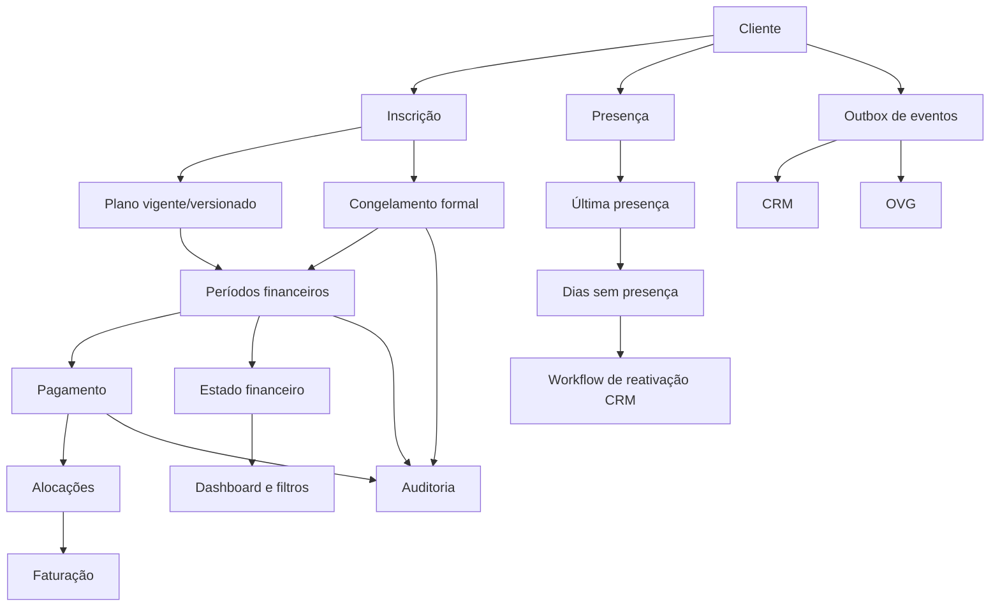

# 07 — Workflow da BD

## Workflow financeiro
1. Validar cliente, plano, datas, duração e idempotência.
2. Criar/atualizar inscrição e versão de plano dentro de transação.
3. Gerar períodos com calendário real e snapshots de preço/aulas.
4. Registar pagamento confirmado, alocar valor e recalcular todos os períodos afetados.
5. Criar auditoria e eventos de integração na mesma transação.
6. Worker publica a outbox com retries e idempotência.

## Workflow de ausência
A última presença é consultada por cliente. O número de dias é calculado no fuso oficial. Sem congelamento formal, a ausência não altera a dívida nem congela períodos; a regra do plano mínimo é aplicada apenas após a decisão funcional sobre o seu significado contratual.
